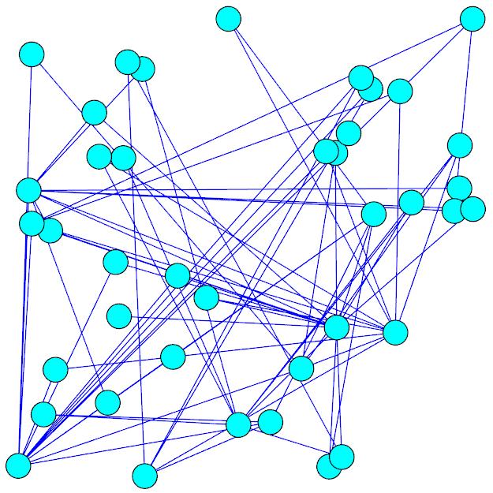
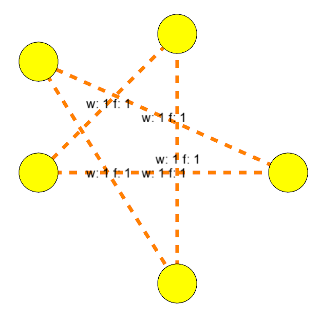

# GraphViewerCpp


**GraphViewerCpp** is a tool for **graph visualization** using the SFML library, in the context of the **Algorithm Design and Analysis** course, at **FEUP**. It has been primarily developed by [Diogo Rodrigues](https://github.com/dmfrodrigues), and is to be mantained by the course's Teaching Assistant students.

## Setting up the environment (CLion IDE)

1. Apply for a JetBrains Educational Pack using the link: https://www.jetbrains.com/shop/eform/students and using you upXXXXXXXXX@fe.up.pt, so that JetBrains identifies you as a real student.
2. Install CLion. Somewhere during the installation, you should be prompted to active you JetBrains account. Please insert the credentials you obtained in the previous step ("Get Licence From:" => "JB account")
3. Install a JDK (it is likely that you already have one)
4. If you are using Windows, you might need to setup an environment. You can find documentation on how to do it here: https://www.jetbrains.com/help/clion/quick-tutorial-on-configuring-clion-on-windows.html
5. For more details or other issues, please use https://www.jetbrains.com/help/clion/clion-quick-start-guide.html

## Dependencies

You will have to install the [SFML](https://www.sfml-dev.org/) library.

### Linux

Under Linux you are strongly advised to use your package manager if SFML is available; under Debian/Ubuntu you can use `sudo apt-get install libsfml-dev`.

### Microsoft Windows

Under Windows you will have to setup SFML.

#### Compiler

In all likelihood you have `cl` (the Microsoft Windows C/C++ compiler) by default, but I advise you to use a [MinGW-w64](https://mingw-w64.org/doku.php) compiler (you can use [MinGW-w64 v7.3.0 64bit with SEH exceptions](https://sourceforge.net/projects/mingw-w64/files/Toolchains%20targetting%20Win64/Personal%20Builds/mingw-builds/7.3.0/threads-posix/seh/x86_64-7.3.0-release-posix-seh-rt_v5-rev0.7z/download)).

#### Installing SFML

The easiest way is to [download one of the binaries](https://www.sfml-dev.org/download/sfml/2.5.1/) that matches your compiler (if you followed the above suggestion, these are the [corresponding SFML binaries](https://www.sfml-dev.org/files/SFML-2.5.1-windows-gcc-7.3.0-mingw-64-bit.zip)).

1. Download the [binaries](https://www.sfml-dev.org/files/SFML-2.5.1-windows-gcc-7.3.0-mingw-64-bit.zip) to the Download folder
2. Create directory `C:\sfml`
3. Extract the archive to `C:\sfml` so that the path `C:\sfml\SFML-2.5.1-windows-gcc-7.3.0-mingw-64-bit\SFML-2.5.1` exists
4. Create environment variable `SFML_PATH`, with value `C:\sfml\SFML-2.5.1-windows-gcc-7.3.0-mingw-64-bit\SFML-2.5.1`
5. Add to system environment variable `PATH` the path `%SFML_PATH%\bin` so Windows can find the DLLs.
6. In your CMake files, don't forget to add

```cmake
if (WIN32)
    include_directories("$ENV{SFML_PATH}/include")
    link_directories("$ENV{SFML_PATH}/lib")
endif()
```

so the compiler can find the SFML headers and libraries (see the [example](example/CMakeLists.txt) for some more insight).

## Running the example

### Linux bash

1. Go to the `example` folder
2. Run the following to create a makefile and use it to compile the project:
```sh
mkdir build
cd build
cmake ..
cmake --build .
```
3. Run the project by calling the binary file that was created in `example/example`

### CLion

1. Clone/download this repository
2. Open CLion > Open > Choose the example dir in the repository
3. Run the project. You will the following three different graphs being loaded, in different windows



